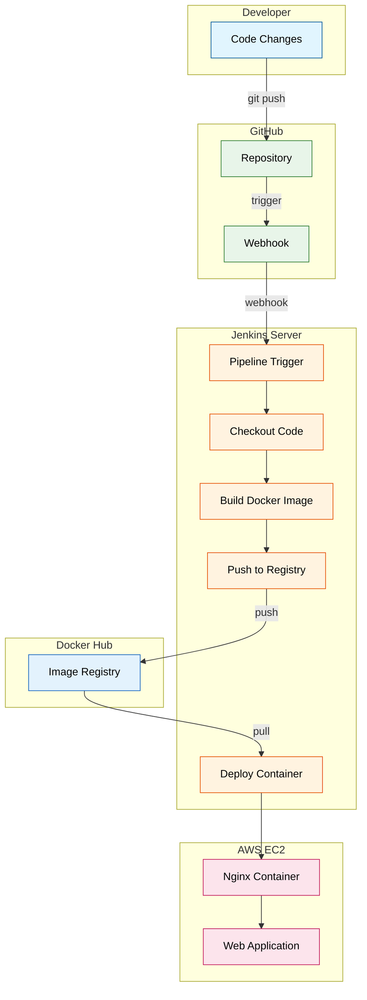
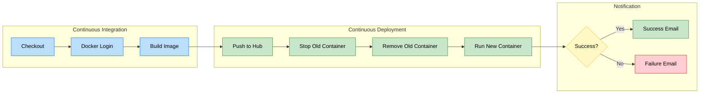
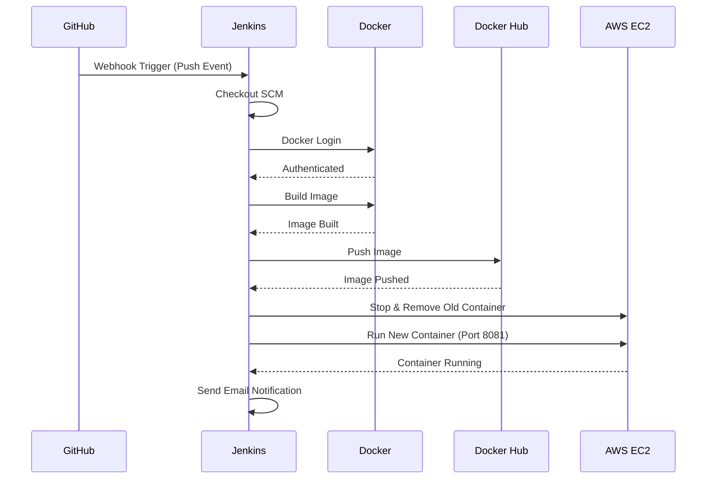
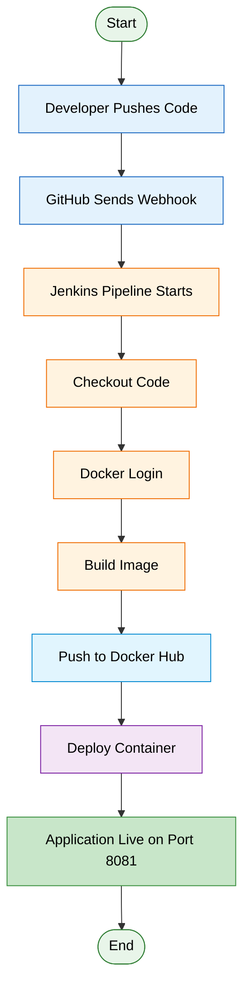
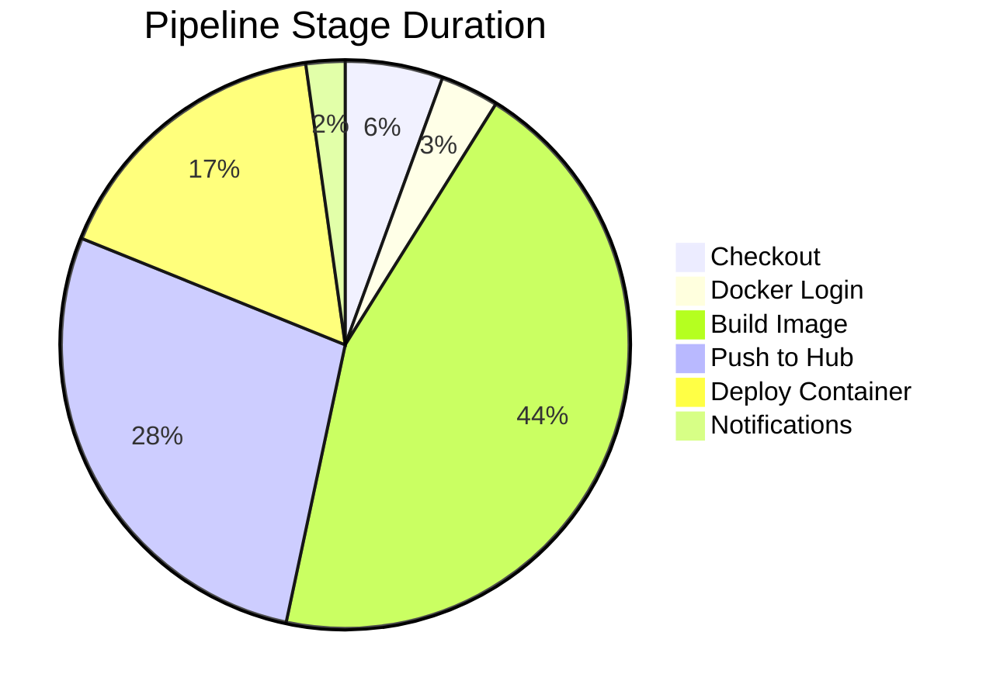

# 🚀 Jenkins CI/CD Pipeline with Docker & GitHub

<div align="center">


**A complete CI/CD automation pipeline demonstrating continuous integration and deployment using modern DevOps tools.**

</div>

---

## 📌 Project Overview

This repository showcases a fully automated **CI/CD pipeline** that builds, tests, and deploys a web application using industry-standard DevOps practices.

### ✨ Key Features

| Feature | Status |
|---------|--------|
| GitHub Push Trigger | ✅ Working |
| Automated Docker Build | ✅ Working |
| Docker Hub Push | ✅ Working |
| Container Deployment | ✅ Working |
| Email Notifications | 🔧 In Progress |

---

## 🏗️ Architecture Overview



---

## 🔄 CI/CD Pipeline Flow



---

## 📂 Project Structure

```
CI-CD-FIRST/
│
├── 📄 index.html          # Main web application page
├── 🎨 style.css           # Application styling
├── ⚡ script.js           # Interactive functionality
├── 🐳 Dockerfile          # Container build instructions
├── 🔧 Jenkinsfile         # CI/CD pipeline definition
└── 📖 README.md           # Project documentation
```

### File Descriptions

| File | Purpose |
|------|---------|
| `index.html` | Demo web page displaying CI/CD pipeline status with interactive elements |
| `style.css` | Modern CSS styling with gradient headers and responsive design |
| `script.js` | JavaScript for simulating deployment status animations |
| `Dockerfile` | Nginx-based container configuration for serving the web app |
| `Jenkinsfile` | Complete pipeline with 5 stages + email notifications |

---

## 🛠️ Tech Stack

| Category | Technologies |
|----------|-------------|
| **Source Control** | GitHub, Webhooks |
| **CI/CD Engine** | Jenkins, Pipeline as Code |
| **Containerization** | Docker, Nginx |
| **Registry** | Docker Hub |
| **Cloud** | AWS EC2, Ubuntu |
| **Notifications** | Email Plugin |

---

## 📜 Pipeline Stages



---

## ⚙️ Jenkinsfile Configuration

```groovy
pipeline {
    agent any

    environment {
        IMAGE_NAME     = "mohammadkasim/cicd-demo"
        CONTAINER_NAME = "cicd-demo-app"
    }

    stages {
        stage('Checkout SCM')          { /* Clone repository */ }
        stage('Docker Login')          { /* Authenticate with Docker Hub */ }
        stage('Build Image')           { /* Build Docker image */ }
        stage('Push Image to DockerHub') { /* Push to registry */ }
        stage('Run Container')         { /* Deploy on EC2 */ }
    }

    post {
        success { /* Send success email */ }
        failure { /* Send failure email */ }
        always  { /* Log completion */ }
    }
}
```

---

## 🐳 Docker Configuration

```dockerfile
FROM nginx:latest
COPY . /usr/share/nginx/html/
```

The application runs on **Nginx** web server inside a Docker container:
- **Base Image:** `nginx:latest`
- **Exposed Port:** `80` (mapped to `8081` on host)
- **Content Location:** `/usr/share/nginx/html/`

---

## 🚀 Deployment Flow



---

## 🖥️ Web Application Features

The demo web application includes:

- **Header:** Displays pipeline status with deployment timestamp
- **Status Panel:** Real-time deployment status indicator
- **Simulate Button:** Interactive deployment simulation
- **Pipeline Steps:** Visual representation of the CI/CD flow
- **Responsive Design:** Modern gradient styling

### Application Preview

| Component | Description |
|-----------|-------------|
| Header | Blue gradient with deployment info |
| Status Card | Shows pending/success states |
| Pipeline Flow | Step-by-step visual guide |
| Footer | Project attribution |

---

## 📧 Email Notifications

The pipeline is configured to send email notifications:

| Event | Recipient | Subject |
|-------|-----------|---------|
| Success | Configured email | ✅ Jenkins SUCCESS: {JOB_NAME} #{BUILD_NUMBER} |
| Failure | Configured email | ❌ Jenkins FAILED: {JOB_NAME} #{BUILD_NUMBER} |

> **Note:** Email notifications require proper SMTP configuration in Jenkins.

---

## 🔧 Prerequisites

To run this pipeline, ensure you have:

- [ ] Jenkins server (can run in Docker)
- [ ] Docker installed on Jenkins agent
- [ ] Docker Hub account and credentials
- [ ] GitHub repository with webhook configured
- [ ] AWS EC2 instance (optional for cloud deployment)

---

## 🏃 Quick Start

1. **Clone the repository**
   ```bash
   git clone https://github.com/Kasim2908/CI-CD-FIRST.git
   ```

2. **Configure Jenkins credentials**
   - Add Docker Hub credentials with ID: `dockerhub-creds`

3. **Set up GitHub Webhook**
   - URL: `http://<jenkins-url>/github-webhook/`
   - Events: Push

4. **Run the pipeline**
   - Push any change to trigger automatic deployment

---

## 📊 Pipeline Execution Summary



---

## 🤝 Contributing

Contributions are welcome! Please feel free to submit a Pull Request.

---

## 📝 License

This project is open source and available under the [MIT License](LICENSE).

---

<div align="center">

**Built with ❤️ by DevOps Engineer | CI/CD Automation Project**

</div>
                    sh '''
                        echo "$DOCKER_PASS" | docker login -u "$DOCKER_USER" --password-stdin
                    '''
                }
            }
        }

        stage('Build Image') {
            steps {
                sh 'docker build -t $IMAGE_NAME .'
            }
        }

        stage('Push Image') {
            steps {
                sh 'docker push $IMAGE_NAME'
            }
        }

        stage('Run Container') {
            steps {
                sh '''
                    docker stop $CONTAINER_NAME || true
                    docker rm $CONTAINER_NAME || true
                    docker run -d -p 8081:80 --name $CONTAINER_NAME $IMAGE_NAME
                '''
            }
        }
    }

    post {
        success {
            email to (
                subject: "✅ Jenkins Build SUCCESS: ${env.JOB_NAME} #${env.BUILD_NUMBER}",
                body: """
                <h2>Build Successful 🎉</h2>
                <p><b>Job:</b> ${env.JOB_NAME}</p>
                <p><b>Build:</b> #${env.BUILD_NUMBER}</p>
                <p><b>URL:</b> <a href="${env.BUILD_URL}">${env.BUILD_URL}</a></p>
                """,
                to: "your-email@example.com"
            )
        }

        failure {
            email to (
                subject: "❌ Jenkins Build FAILED: ${env.JOB_NAME} #${env.BUILD_NUMBER}",
                body: """
                <h2>Build Failed ❌</h2>
                <p><b>Job:</b> ${env.JOB_NAME}</p>
                <p><b>Build:</b> #${env.BUILD_NUMBER}</p>
                <p><b>Logs:</b> <a href="${env.BUILD_URL}console">${env.BUILD_URL}console</a></p>
                """,
                to: "your-email@example.com"
            )
        }
    }
}
